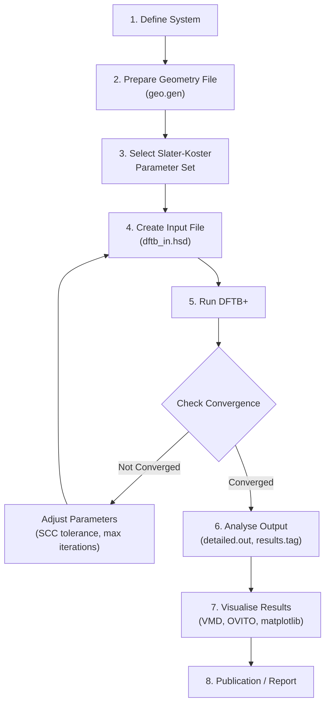
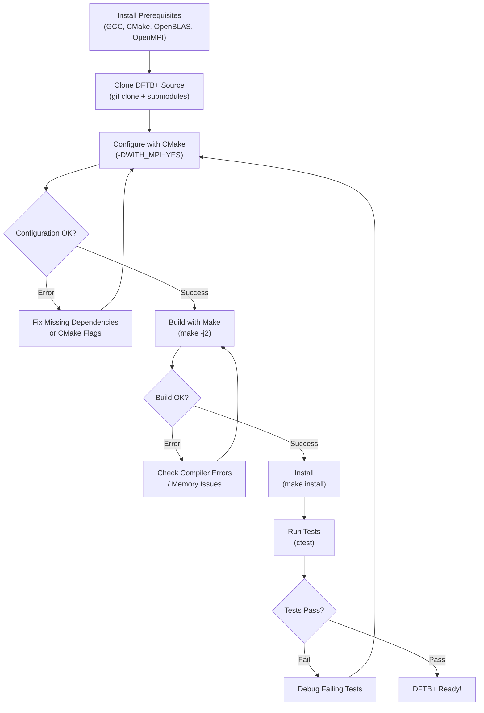
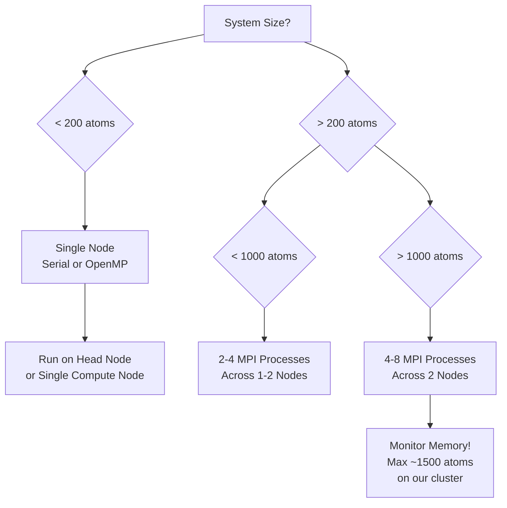
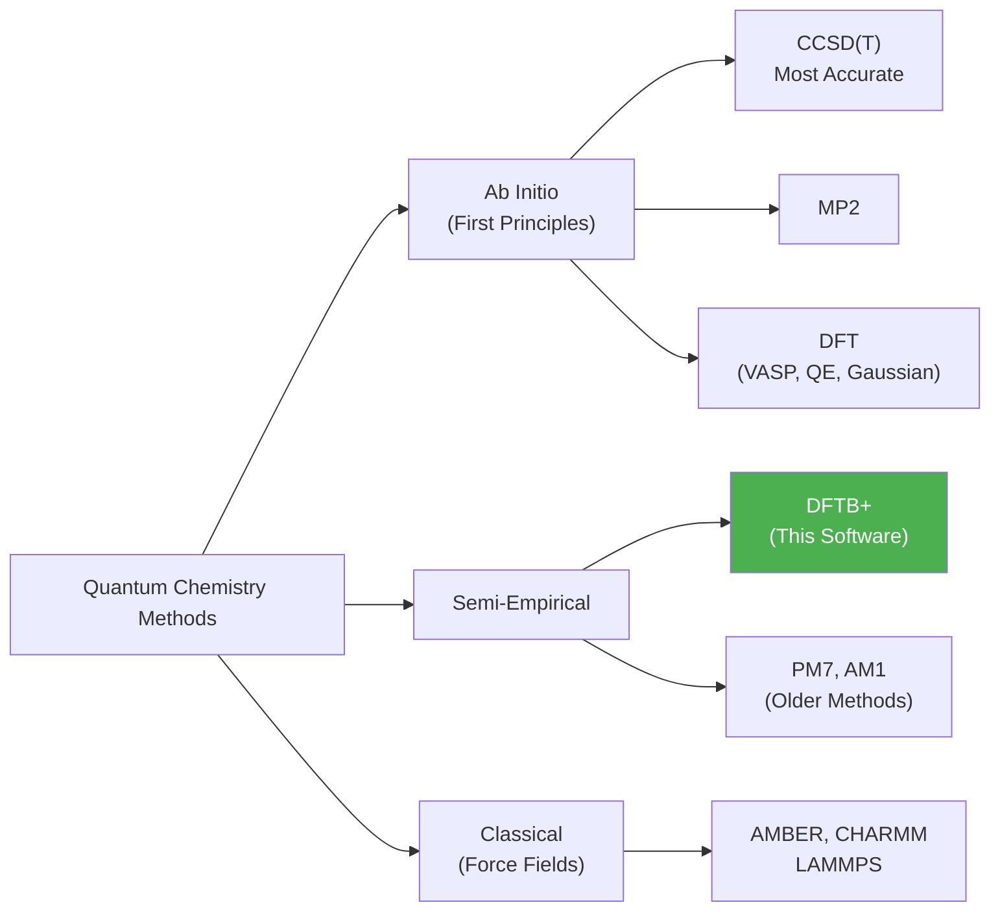
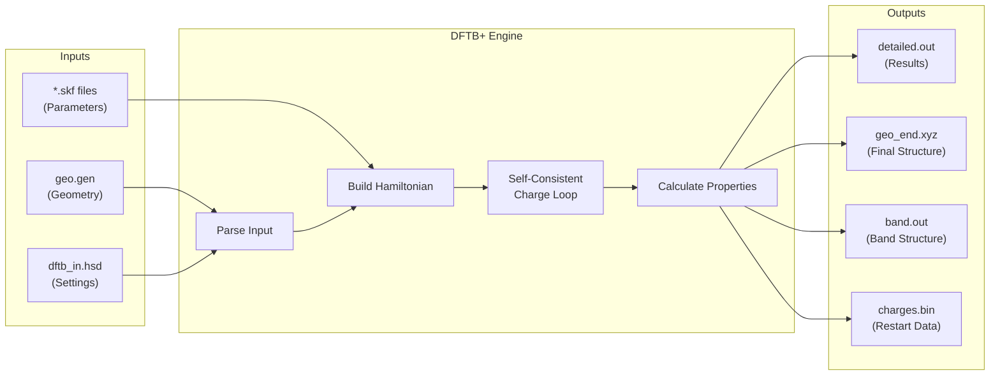

# DFTB+ Workflow Diagrams

## Overall DFTB+ Simulation Workflow

## Build Process Workflow

## Parallelisation Decision Tree

## DFTB Method Hierarchy

## Data Flow in a Typical DFTB+ Calculation

